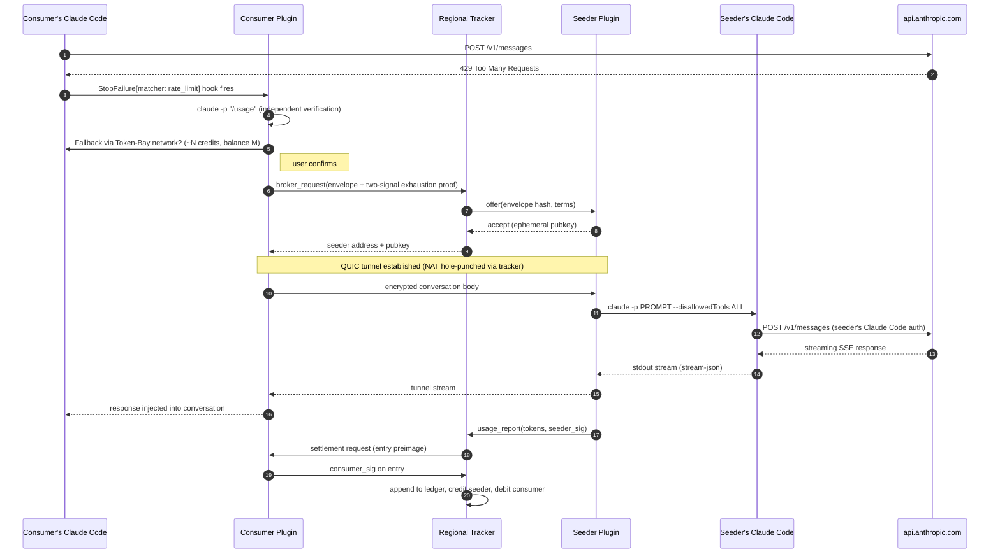

# Token-Bay

> **A BitTorrent for Claude Code rate limits — as a design exercise, not a real service.**

**⚠️ This is not software you should run.** Token-Bay imagines what a P2P network for sharing Claude Code capacity *would* look like, but actually deploying it would violate Anthropic's Terms of Service. This repo is a set of **design specs, implementation plans, and reference scaffolding**. The product here is the architecture, not the binaries.

---

## The scenario

It's 3pm. You're mid-flow in Claude Code, debugging something gnarly. You hit a rate limit. Claude Code refuses your next prompt. The flow dies. You make coffee, switch to Slack, and never quite recover.

Meanwhile, someone else is on the same Claude plan as you. They opened Claude once this morning, wrote a couple of prompts, and haven't touched it since. Their 5-hour quota window is **90% idle** and will reset at 8pm, wasted.

You're both paying for rate-limited capacity. At any given moment, only one of you is actually using yours.

## The thought experiment

**What if you could share?**

When you hit a rate limit, what if your Claude Code could transparently borrow someone else's idle capacity — and later, during your own quiet hours, you'd pay them back?

That's BitTorrent's model: **peers share resources, a tracker coordinates who's available, a ledger keeps score.** Token-Bay applies that model to Claude Code rate-limit capacity instead of file chunks.

## Why we can't actually build this

Credential sharing across users violates Anthropic's Terms of Service. Full stop. That rules out anything that looks like a real product.

But that ToS constraint is what makes the *design* interesting. Once "just share the API key" is off the table, you're forced into genuinely hard distributed-systems territory:

- **How do you prove that a user really hit their rate limit**, without sharing credentials? *(Answer: two independent signals from their own Claude Code, both signed — a `StopFailure{rate_limit}` hook event and a `/usage` probe.)*
- **How do you stop a malicious borrower from turning the lender's Claude Code into an attacker's shell?** *(Answer: `claude -p "<prompt>"` with every side-effecting tool disabled — no `Bash`, no `Read`/`Write`, no MCP, no hooks — enforced by a conformance test suite of adversarial prompts.)*
- **How do you run a credit ledger across thousands of users without a central authority?** *(Answer: federated regional trackers, each owning a signed append-only log, with hourly Merkle roots gossiped between them.)*
- **How do you prevent someone from minting 10,000 fake identities to farm credits?** *(Answer: one network identity per real Claude Code account, bound via a signed challenge — a sybil costs a real paid account.)*
- **How do you detect a regional tracker that secretly rewrites its own ledger?** *(Answer: peer trackers archive each other's Merkle roots — a rewrite gets outed on the next gossip round.)*

Those problems are where the real engineering lives. Token-Bay is a vehicle for exploring them.

---

## The BitTorrent analogy, one-to-one

| BitTorrent | Token-Bay |
|---|---|
| File chunks | Claude API calls (`/v1/messages`) |
| Trackers | Regional tracker servers |
| Seeders | Users with idle Claude Code capacity |
| Leechers | Users whose rate limit is exhausted |
| P2P chunk transfer | P2P encrypted request tunnel (QUIC) |
| Share ratio / karma | Signed credit ledger |
| DHT / multi-tracker | Federation — trackers peer and gossip Merkle roots |
| `.torrent` announce | `broker_request` to a regional tracker |

Users install **one Claude Code plugin** that plays both roles depending on context:

- **Consumer** — when Claude Code hits a rate limit, the plugin detects it via Claude Code's `StopFailure{rate_limit}` hook, double-checks with `claude -p "/usage"`, asks you to confirm, and routes the request over the network.
- **Seeder** — during idle windows you configure (e.g. `02:00–06:00` local time), the plugin accepts forwarded requests from other users and serves them via `claude -p "<prompt>"` **with every side-effecting tool disabled**.

**Trackers** are lightweight coordination servers — one per region. They hold the live registry of available seeders, broker incoming requests, and own a tamper-evident credit ledger. Trackers peer with each other so credits earned in one region are spendable in another.

## How a single request flows



Each settled request produces a single ledger entry carrying **three signatures** — consumer, seeder, tracker — so any party can later prove what they did or didn't agree to, and any one party lying is immediately detectable.

## The load-bearing design ideas

- **The plugin never touches an Anthropic API key.** All Anthropic traffic goes through the user's own `claude` CLI. Token-Bay sits next to Claude Code, not in front of it.
- **Seeder-side safety via tool disabling.** When you seed, the visitor's prompt reaches a `claude -p` subprocess with every side-effecting primitive off. A malicious prompt can steer Claude's *text output*, but it cannot touch your filesystem, shell, or network. A conformance test of adversarial prompts runs on every release and refuses to allow seeding if any side effect is detected.
- **Two-signal exhaustion proof.** The network only engages when both (a) Claude Code raised `StopFailure{rate_limit}` on its own, and (b) an independent `claude -p "/usage"` probe confirms. Both signals travel with the request under the consumer's signature — forgery requires fabricating both coherently.
- **Tamper-evident credit ledger.** Every settled request is an append-only, hash-chained, triple-signed entry. Hourly Merkle roots gossip federation-wide — a tracker that rewrites history gets outed by peers holding its older roots.
- **Identity = one real Claude Code account.** Network identity is cryptographically bound to Claude Code auth, so sybils cost real paid accounts.

---

## Repo layout

```
token-bay/
├── plugin/     — Claude Code plugin (consumer + seeder roles)
├── tracker/    — regional coordination server
├── shared/     — shared Go library (wire formats, crypto, common types)
├── docs/
│   └── superpowers/
│       ├── specs/  — architecture + subsystem specs
│       └── plans/  — scaffolding and implementation plans
├── CLAUDE.md   — repo-level development context
└── Makefile    — orchestrates test/build across modules
```

Each subsystem has its own `CLAUDE.md` (working rules) and `Makefile` (component-level commands). Tech stack: Go 1.23+ workspaces, QUIC via [`quic-go`](https://github.com/quic-go/quic-go), SQLite via [`modernc.org/sqlite`](https://modernc.org/sqlite) (pure-Go, no cgo).

## Status

**Design phase — no working features yet.**

What *is* done:

- [Root architecture spec](docs/superpowers/specs/2026-04-22-token-bay-architecture-design.md) with every load-bearing decision and its rationale
- Subsystem specs: plugin, tracker, federation, ledger, exhaustion-proof, reputation
- [Scaffolding plans](docs/superpowers/plans/) executed end-to-end — foundation + shared + plugin + tracker modules are all up, each with a minimal `version` command and a CI workflow

What's *not* done:

- Any feature beyond `version`. Feature plans per subsystem module are the next batch of work.
- The TEE-tier subsystem spec is **paused pending redesign** — its original premise (passing an API token into an enclave) no longer applies under the Claude-Code-bridge architecture.

## Running it locally

Prerequisites: Go 1.23+, `make`, `golangci-lint`, `lefthook`, the `claude` CLI installed and authenticated.

```bash
git clone https://github.com/dordor12/token-bay
cd token-bay
go work sync
make check         # test + lint across all three modules
```

At this stage `make check` passes but there's no feature to demo — the binaries have only a `version` command so far. Installation hooks and the `claude -p` bridge glue are in the upcoming feature plans.

Component-specific commands live per-subdirectory:

- `make -C plugin conformance` — bridge safety suite (adversarial prompts vs. the `claude -p` tool-disabling flags)
- `make -C tracker run-local` — spin up a local tracker with a throwaway keypair (currently a placeholder stub)
- `make -C shared test` — shared library tests

Install [lefthook](https://github.com/evilmartians/lefthook) and run `lefthook install` in the repo root to enable pre-commit hygiene (gofumpt, go vet, golangci-lint, plugin bridge conformance on touched files).

## Where to go deeper

- [**Root architecture spec**](docs/superpowers/specs/2026-04-22-token-bay-architecture-design.md) — every architectural decision with trade-offs. Start here if you want to understand the system.
- [**Subsystem specs**](docs/superpowers/specs/) — one per subsystem, each with interfaces / data models / algorithms / failure modes / acceptance criteria.
- [**Implementation plans**](docs/superpowers/plans/) — TDD-structured, bite-sized task lists that generated the commits in `main`.
- [Repo-root `CLAUDE.md`](CLAUDE.md) — the context Claude Code itself reads when working in this repo.

## License

TBD.
