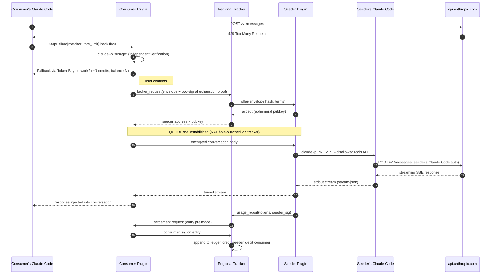

# Monorepo Foundation — Scaffolding Plan

> **For agentic workers:** REQUIRED SUB-SKILL: Use superpowers:subagent-driven-development (recommended) or superpowers:executing-plans to implement this plan task-by-task. Steps use checkbox (`- [ ]`) syntax for tracking.

**Goal:** Establish the monorepo's root layout and cross-component tooling so plugin, shared, and tracker can be scaffolded inside it. Produces a working Go workspace with no component code yet.

**Architecture:** Single Git repository at `/Users/dor.amid/git/token-bay/`. Three Go modules — `plugin/`, `shared/`, `tracker/` — linked by a top-level `go.work` file. Root owns repo-wide concerns (CLAUDE.md, CI, lint config, commit hooks); each component owns its own build targets and module-specific rules.

**Tech Stack (root-level):**
- Go 1.23+ workspaces (`go.work`)
- GNU Make (root-level orchestrator)
- `golangci-lint` (config at root, applies to all modules)
- `lefthook` (pre-commit, repo-wide)
- GitHub Actions CI (root workflow runs per-module matrix)

**Dependency order:** This plan runs **first**. `shared`, `plugin`, and `tracker` scaffolding plans follow, in that order.

---

## Table of contents

1. [Layout decisions](#1-layout-decisions)
2. [Root-level CLAUDE.md](#2-root-level-claudemd)
3. [Scaffolding tasks](#3-scaffolding-tasks)

---

## 1. Layout decisions

### 1.1 Target tree (after all four scaffolding plans complete)

```
token-bay/
├── .github/
│   └── workflows/
│       ├── ci.yml                          # this plan: module matrix
│       └── plugin-conformance.yml          # plugin plan: bridge conformance
├── docs/
│   └── superpowers/
│       ├── specs/                          # already present
│       └── plans/                          # already present
├── plugin/                                 # Plan 1 — Claude Code plugin
│   ├── .claude-plugin/plugin.json
│   ├── commands/*.md
│   ├── hooks/*.json
│   ├── cmd/token-bay-sidecar/
│   ├── internal/...
│   ├── test/...
│   ├── CLAUDE.md                           # plugin-specific rules
│   ├── Makefile
│   └── go.mod
├── shared/                                 # Plan 2 — shared Go module
│   ├── proto/
│   ├── exhaustionproof/
│   ├── signing/
│   ├── ids/
│   ├── CLAUDE.md
│   └── go.mod
├── tracker/                                # Plan 3 — tracker server
│   ├── cmd/token-bay-tracker/
│   ├── internal/{broker,ledger,federation,reputation,registry,stunturn,api,config}/
│   ├── test/...
│   ├── CLAUDE.md
│   ├── Makefile
│   └── go.mod
├── .gitignore
├── .golangci.yml
├── .editorconfig
├── CLAUDE.md                               # repo-level context
├── go.work
├── lefthook.yml
├── Makefile                                # root orchestrator
└── README.md
```

### 1.2 Why a Go workspace, not a single module

Each component has its own distinct dependency set (plugin needs `quic-go`, Claude Code plugin SDK bits; tracker needs database, HTTP/gRPC server libs; shared is a leaf library). Separate `go.mod` files let each component manage deps independently and produce its own release binary. `go.work` stitches them together for local development so a change in `shared/` is visible to `plugin/` and `tracker/` without publishing a tagged release.

### 1.3 Root Makefile delegates

The root `Makefile` is a thin orchestrator:

```make
.PHONY: test lint check build
test:
	$(MAKE) -C plugin test
	$(MAKE) -C tracker test
	$(MAKE) -C shared test
lint:
	golangci-lint run ./...
check: test lint
build:
	$(MAKE) -C plugin build
	$(MAKE) -C tracker build
```

Each component directory has its own Makefile with component-specific targets (e.g. `plugin/` has `make conformance` for bridge conformance; `tracker/` has `make run-local` for local dev).

### 1.4 One `.golangci.yml` at the root

Linting policy is repo-wide — consistency across components matters more than per-component flexibility. Exceptions (e.g. `plugin/` may need to allow exec.Command which `gosec` flags) go in per-directory overrides via `issues.exclude-rules`.

---

## 2. Root-level CLAUDE.md

The file that goes at `/Users/dor.amid/git/token-bay/CLAUDE.md` — read by every Claude Code session regardless of which component is being worked on.

````markdown
# Token-Bay — Repository Context

## What this is

**Educational / research exercise** in distributed-systems design. Token-Bay explores a federated P2P network for sharing Claude Code rate-limit capacity between consenting users. It is **not production software targeting live Anthropic accounts** — credential sharing would violate Anthropic's terms. The design explores the *protocol patterns* (federated trackers, signed reputation, P2P tunnels) using Claude rate-limit capacity as the notional payload.

## Repo layout

Monorepo with three Go modules linked by `go.work`:

- `plugin/` — Claude Code plugin (consumer + seeder roles). Has `plugin/CLAUDE.md`.
- `tracker/` — regional coordination server. Houses broker, ledger, federation, reputation as internal modules. Has `tracker/CLAUDE.md`.
- `shared/` — shared Go library. Wire formats, crypto helpers, common types. Has `shared/CLAUDE.md`.

Specs live at `docs/superpowers/specs/`. Plans at `docs/superpowers/plans/`. Always read the relevant subsystem spec before making non-trivial changes in a component.

## Non-negotiable repo-wide rules

1. **No third-party crypto.** Ed25519 uses stdlib `crypto/ed25519`. No libsodium, no OpenSSL bindings. Applies across all three modules.
2. **No Anthropic API key handling in code.** Not in plugin, not in tracker, not in shared. The architecture eliminates the need entirely.
3. **Shared types live in `shared/`.** Never duplicate a wire-format struct between `plugin/` and `tracker/`. If both sides need it, it's a `shared/` contribution.
4. **Breaking changes to `shared/` are coordinated.** A PR that modifies `shared/` must update callers in `plugin/` and `tracker/` in the same PR.
5. **Append-only audit logs and ledger entries are permanent.** No rewrite, no truncate — only rotation by file.

## Working across modules

Run `go work sync` after pulling to sync the workspace. The `go.work` file is committed; local-only overrides go in `go.work.local` (ignored by git — not created by default).

## Commands you'll use daily (from repo root)

| Command | Effect |
|---|---|
| `make test` | Runs `go test -race ./...` in each module |
| `make lint` | `golangci-lint run ./...` across all modules |
| `make build` | Builds all component binaries |
| `make check` | `test` + `lint` |

Module-specific commands live in each component's Makefile — e.g. `make -C plugin conformance` or `make -C tracker run-local`.

## Development workflow

TDD is the discipline across the entire repo — failing test first, green, refactor, commit. One conventional-commit per red-green cycle (`feat:`, `fix:`, `test:`, `refactor:`, `docs:`, `chore:`, `ci:`).

Commits should be small and should not cross component boundaries unless necessary. A change to `shared/` that requires updates in `plugin/` and `tracker/` is the legitimate exception and goes in a single cross-cutting commit.

## Where to ask questions

Open a GitHub issue. Architecture discussion on the issue; the spec is the source of truth. If the spec is wrong or ambiguous, fix it in a PR alongside any code change.
````

Plugin-specific and tracker-specific CLAUDE.md files will be written in their respective scaffolding plans.

---

## 3. Scaffolding tasks

### Task 1: Initialize git at repo root

**Files:**
- Modify: `/Users/dor.amid/git/token-bay/.git/` (via `git init`)

- [ ] **Step 1: Initialize git repository**

Run:
```bash
cd /Users/dor.amid/git/token-bay
git init
```

- [ ] **Step 2: Verify empty repository**

Run: `git status`
Expected: "On branch main ... No commits yet ... Untracked files: docs/" (the existing specs dir).

### Task 2: Write root `.gitignore`

**Files:**
- Create: `/Users/dor.amid/git/token-bay/.gitignore`

- [ ] **Step 1: Create `.gitignore`**

Write to `/Users/dor.amid/git/token-bay/.gitignore`:
```
# Go build artifacts
bin/
coverage.out
*.test
*.out
vendor/

# Go workspace local overrides
go.work.local

# OS
.DS_Store
Thumbs.db

# Editors
.vscode/
.idea/
*.swp
*~

# Superpowers scratch area
.superpowers/

# Local runtime data
~/.token-bay/
.token-bay-local/
```

- [ ] **Step 2: Commit**

```bash
git add .gitignore
git commit -m "chore: initialize .gitignore"
```

### Task 3: Write root `README.md`

**Purpose of this task:** the README is the first thing anyone sees. A drive-by visitor must, in under two minutes, understand **what this project is, why it exists, and roughly how it works.** The content below uses the BitTorrent analogy (familiar mental model for most developers) and embeds a Mermaid sequence diagram (renders natively on GitHub) for the request flow.

**Files:**
- Create: `/Users/dor.amid/git/token-bay/README.md`

- [ ] **Step 1: Create README**

Write to `/Users/dor.amid/git/token-bay/README.md`:

````markdown
# Token-Bay

> **A BitTorrent-style peer-to-peer network for sharing Claude Code rate-limit capacity.** Educational / research exercise in distributed-systems design.

## What is this?

Token-Bay is an educational design project that asks: *what if we applied BitTorrent's architecture — trackers, seeders, peer-to-peer transfer, reputation — to a very different problem: sharing Claude Code rate-limit capacity between consenting users?*

The problem it explores:

- You pay for Claude Code. Your rate-limit window resets every few hours.
- Most of the day, your account is idle — that window is heavily underused.
- Somewhere else, another user has burned through their quota and can't work.
- **What if their Claude Code could transparently borrow your idle capacity during time you'd otherwise waste — and you could borrow theirs when you're the one who's stuck?**

Token-Bay isn't meant to be *deployed* — doing so would violate Anthropic's Terms of Service and raises real privacy concerns. But the **protocol patterns** that appear when you try to design such a system are a rich playground for distributed-systems concepts: federated coordination, signed reputation, cryptographic proofs of resource state, NAT traversal, idempotent credit ledgers, tamper-evident history.

**This repo is the design specs, implementation plans, and (eventually) the reference code.**

## The BitTorrent mental model

If you know BitTorrent, the pieces map almost one-to-one:

| BitTorrent | Token-Bay |
|---|---|
| File chunks | Claude API calls (`/v1/messages`) |
| Tracker | Regional tracker server |
| Seeder | User with idle Claude Code capacity |
| Leecher | User whose rate limit is exhausted |
| Peer-to-peer chunk transfer | Peer-to-peer request proxying |
| Share ratio / karma | Signed credit ledger (tracker + both peers sign) |
| DHT / multi-tracker | Tracker federation (Merkle-root gossip between regions) |
| `.torrent` announce | `broker_request` to regional tracker |

Users install a **Claude Code plugin** that can play two roles at once:

- **Consumer** — when Claude Code hits a rate-limit error, the plugin detects it via Claude Code's `StopFailure{rate_limit}` hook, asks the user for confirmation, and routes the request through the network.
- **Seeder** — during idle windows the user configures (e.g. `02:00–06:00` local time), the plugin accepts forwarded requests from other users and serves them via `claude -p "<prompt>"` with **all tool access disabled** (no `Bash`, no `Read`, no `Write`, no MCP, no hooks — see "safety" below).

**Trackers** are lightweight coordination servers. One per region. They maintain a live registry of available seeders, broker incoming requests, and own a tamper-evident **credit ledger** of settled requests. Trackers peer with each other — Merkle-root gossip lets you detect a tracker that rewrites its history, and signed transfer proofs let credits earned in one region be spent in another.

## How a request flows (end-to-end)



Each settled request produces one ledger entry carrying **three signatures** — consumer, seeder, tracker — so any party can later prove what they did or did not agree to.

## Non-obvious architecture properties

- **The plugin never handles an Anthropic API key.** All Anthropic traffic goes through the user's own `claude` CLI. Token-Bay sits next to Claude Code, not in front of it.
- **Seeder-side safety.** When you seed, the consumer's prompt reaches a `claude -p` subprocess with **every side-effecting primitive disabled** — no tool use, no MCP, no hooks. A malicious prompt can steer Claude's text output, but it cannot touch the seeder's filesystem, shell, or network. A conformance test suite runs adversarial prompts against the configured flags and enforces zero observable side effects.
- **Two-signal exhaustion proof.** The network only engages when (a) Claude Code says `StopFailure{rate_limit}`, *and* (b) an independent `claude -p "/usage"` probe agrees. Both signals are signed and travel with the request, so forgery requires fabricating both coherently.
- **Tamper-evident credit ledger.** Every settled request is an append-only, hash-chained, triple-signed ledger entry. Each tracker commits an hourly Merkle root, gossiped federation-wide — a tracker that tries to rewrite history gets exposed by peers holding its archived roots.
- **Identity is tied to Claude Code accounts.** The plugin can't just mint 10,000 fake identities to farm credits because identity binding uses a signed challenge mediated by the Claude Code bridge. One Claude Code account → one network identity. Sybil resistance is ≈ the cost of Claude Code accounts.

## Repo layout

Monorepo with three Go modules linked by a Go workspace:

```
token-bay/
├── plugin/                  — Claude Code plugin (consumer + seeder roles)
├── tracker/                 — regional coordination server
├── shared/                  — shared Go library (wire formats, crypto helpers, common types)
├── docs/superpowers/
│   ├── specs/               — architecture + subsystem design specs
│   └── plans/               — implementation plans
└── CLAUDE.md                — repo-level development context
```

Each component has its own `CLAUDE.md` (development rules) and `Makefile`. The root `Makefile` orchestrates `make test / lint / build / check` across all three.

## Status

**Design phase.** The following are complete:

- Top-level architecture spec: `docs/superpowers/specs/2026-04-22-token-bay-architecture-design.md`
- Subsystem specs: plugin, tracker, federation, ledger, exhaustion-proof, reputation.
- Scaffolding plans for the monorepo, shared library, plugin, and tracker: `docs/superpowers/plans/`.

The TEE-tier subsystem spec is **paused pending redesign** — its original premise (passing an API token into an enclave) no longer applies under the Claude-Code-bridge architecture.

**Not production software.** This is an educational exploration. Deploying it against live Anthropic accounts would violate Anthropic's Terms of Service.

## Getting started (once scaffolded)

Prerequisites:

- Go 1.23+
- `make`
- `golangci-lint`
- `lefthook`
- `claude` CLI (required for seeder role and for bridge conformance tests)

```bash
git clone <repo-url> token-bay
cd token-bay
go work sync
make check         # test + lint across all three modules
```

Component-specific commands live in each subdirectory's `Makefile`:

- `make -C plugin conformance` — bridge safety suite (adversarial prompts vs `claude -p` flags)
- `make -C tracker run-local` — spin up a local tracker with a throwaway keypair and SQLite DB
- `make -C shared test` — shared library tests

## Where to read next

If you want to understand the design: start with the [root architecture spec](docs/superpowers/specs/2026-04-22-token-bay-architecture-design.md). It documents every architectural decision with its rationale and trade-offs.

If you want to contribute: read the root [`CLAUDE.md`](CLAUDE.md), then the component-specific `CLAUDE.md` under whichever directory you're touching.

Subsystem specs live under `docs/superpowers/specs/<subsystem>/`. Implementation plans under `docs/superpowers/plans/`. Each plan is a series of bite-sized, TDD-structured tasks that produce commits — no prose-heavy "do this later" placeholders.

## License

TBD.
````

- [ ] **Step 2: Verify Mermaid renders**

Push a branch to GitHub (or preview locally with a Markdown viewer that supports Mermaid) and confirm the sequence diagram renders as a diagram, not a code block. If it doesn't, the most common culprit is missing ```` ```mermaid ```` fence language — re-check.

- [ ] **Step 3: Commit**

```bash
git add README.md
git commit -m "docs: add repo-level README with BitTorrent analogy and flow diagram"
```

### Task 4: Write root `CLAUDE.md`

**Files:**
- Create: `/Users/dor.amid/git/token-bay/CLAUDE.md`

- [ ] **Step 1: Write `CLAUDE.md`**

Copy the content from §2 of this plan verbatim into `/Users/dor.amid/git/token-bay/CLAUDE.md`. Include all sections: "What this is", "Repo layout", "Non-negotiable repo-wide rules", "Working across modules", "Commands you'll use daily", "Development workflow", "Where to ask questions".

- [ ] **Step 2: Commit**

```bash
git add CLAUDE.md
git commit -m "docs: add repo-level CLAUDE.md"
```

### Task 5: Create component directory placeholders

**Files:**
- Create: `plugin/.gitkeep`, `shared/.gitkeep`, `tracker/.gitkeep`

- [ ] **Step 1: Create directories**

Run:
```bash
cd /Users/dor.amid/git/token-bay
mkdir -p plugin shared tracker
touch plugin/.gitkeep shared/.gitkeep tracker/.gitkeep
```

- [ ] **Step 2: Commit**

```bash
git add plugin/.gitkeep shared/.gitkeep tracker/.gitkeep
git commit -m "chore: scaffold component directory placeholders"
```

### Task 6: Write `go.work` (empty but valid)

**Files:**
- Create: `/Users/dor.amid/git/token-bay/go.work`

- [ ] **Step 1: Create initial `go.work`**

Write to `/Users/dor.amid/git/token-bay/go.work`:
```
go 1.23

// Modules are added by component scaffolding plans:
//   - shared/  (Plan 2)
//   - plugin/  (Plan 1 — revised)
//   - tracker/ (Plan 3)
```

(No `use` directives yet — modules don't exist. Each component plan adds its own `use` entry.)

- [ ] **Step 2: Verify go.work syntax**

Run: `go env GOWORK && cat go.work`
Expected: `GOWORK` path points at this file; content matches.

- [ ] **Step 3: Commit**

```bash
git add go.work
git commit -m "chore: initialize Go workspace"
```

### Task 7: Write root `.golangci.yml`

**Files:**
- Create: `/Users/dor.amid/git/token-bay/.golangci.yml`

- [ ] **Step 1: Create lint config**

Write to `/Users/dor.amid/git/token-bay/.golangci.yml`:
```yaml
run:
  timeout: 5m
  go: '1.23'

linters:
  disable-all: true
  enable:
    - errcheck
    - gofumpt
    - gosec
    - ineffassign
    - misspell
    - revive
    - staticcheck
    - unused

linters-settings:
  revive:
    rules:
      - name: exported
        severity: warning
      - name: var-naming
  gosec:
    excludes:
      - G104  # errcheck covers this

issues:
  exclude-rules:
    - path: _test\.go
      linters:
        - gosec
    # plugin's ccbridge subprocess module intentionally runs external commands
    - path: plugin/internal/ccbridge/.*\.go
      linters:
        - gosec
      text: 'G204'
```

- [ ] **Step 2: Commit**

```bash
git add .golangci.yml
git commit -m "chore: add repo-wide golangci-lint config"
```

### Task 8: Write root `.editorconfig`

**Files:**
- Create: `/Users/dor.amid/git/token-bay/.editorconfig`

- [ ] **Step 1: Create `.editorconfig`**

Write to `/Users/dor.amid/git/token-bay/.editorconfig`:
```
root = true

[*]
end_of_line = lf
insert_final_newline = true
charset = utf-8
trim_trailing_whitespace = true

[*.go]
indent_style = tab
indent_size = 4

[*.{yaml,yml,json,md}]
indent_style = space
indent_size = 2

[Makefile]
indent_style = tab
```

- [ ] **Step 2: Commit**

```bash
git add .editorconfig
git commit -m "chore: add .editorconfig"
```

### Task 9: Write root `Makefile` (orchestrator)

**Files:**
- Create: `/Users/dor.amid/git/token-bay/Makefile`

- [ ] **Step 1: Create Makefile**

Write to `/Users/dor.amid/git/token-bay/Makefile`:
```makefile
.PHONY: all test lint check build clean

MODULES := plugin shared tracker

all: check build

test:
	@for m in $(MODULES); do \
		if [ -f $$m/Makefile ]; then \
			echo "=== test: $$m ==="; \
			$(MAKE) -C $$m test || exit 1; \
		fi; \
	done

lint:
	golangci-lint run ./...

build:
	@for m in $(MODULES); do \
		if [ -f $$m/Makefile ]; then \
			echo "=== build: $$m ==="; \
			$(MAKE) -C $$m build || exit 1; \
		fi; \
	done

check: test lint

clean:
	@for m in $(MODULES); do \
		if [ -f $$m/Makefile ]; then \
			$(MAKE) -C $$m clean || true; \
		fi; \
	done
```

- [ ] **Step 2: Verify it runs (even with no module Makefiles yet)**

Run: `make test`
Expected: no output (the for-loop finds no Makefiles to delegate to).

- [ ] **Step 3: Commit**

```bash
git add Makefile
git commit -m "chore: add root Makefile orchestrator"
```

### Task 10: Write root `lefthook.yml`

**Files:**
- Create: `/Users/dor.amid/git/token-bay/lefthook.yml`

- [ ] **Step 1: Create lefthook config**

Write to `/Users/dor.amid/git/token-bay/lefthook.yml`:
```yaml
pre-commit:
  parallel: true
  commands:
    gofumpt:
      glob: '*.go'
      run: gofumpt -l -w {staged_files}
      stage_fixed: true
    vet:
      glob: '*.go'
      run: go vet ./...
    golangci-lint:
      glob: '*.go'
      run: golangci-lint run --new-from-rev=HEAD
```

(Plugin-specific pre-commit hooks — bridge conformance — are appended by the plugin scaffolding plan via a `lefthook-local.yml` merge or by extending this file.)

- [ ] **Step 2: Document lefthook install**

Append to `/Users/dor.amid/git/token-bay/README.md` under a new "Pre-commit hooks" section:
```markdown

## Pre-commit hooks

Install [lefthook](https://github.com/evilmartians/lefthook), then run `lefthook install` in the repo root.
```

- [ ] **Step 3: Commit**

```bash
git add lefthook.yml README.md
git commit -m "chore: add root lefthook config"
```

### Task 11: Write root CI workflow

**Files:**
- Create: `/Users/dor.amid/git/token-bay/.github/workflows/ci.yml`

- [ ] **Step 1: Create CI workflow**

Run:
```bash
mkdir -p /Users/dor.amid/git/token-bay/.github/workflows
```

Write to `/Users/dor.amid/git/token-bay/.github/workflows/ci.yml`:
```yaml
name: CI

on:
  push:
    branches: [main]
  pull_request:

jobs:
  test:
    strategy:
      fail-fast: false
      matrix:
        os: [ubuntu-latest, macos-latest, windows-latest]
        go: ['1.23']
    runs-on: ${{ matrix.os }}
    steps:
      - uses: actions/checkout@v4
      - uses: actions/setup-go@v5
        with:
          go-version: ${{ matrix.go }}
      - name: Sync workspace
        run: go work sync
      - name: Test
        run: make test
      - name: Build
        run: make build

  lint:
    runs-on: ubuntu-latest
    steps:
      - uses: actions/checkout@v4
      - uses: actions/setup-go@v5
        with:
          go-version: '1.23'
      - uses: golangci/golangci-lint-action@v6
        with:
          version: latest
```

- [ ] **Step 2: Commit**

```bash
git add .github/workflows/ci.yml
git commit -m "ci: add root test + lint workflow"
```

### Task 12: Verify the foundation stands on its own

**Files:**
- None (verification only)

- [ ] **Step 1: Run `make test`**

Run: `make test`
Expected: clean exit with no output (no module Makefiles to delegate to yet).

- [ ] **Step 2: Run `make lint`**

Run: `make lint`
Expected: either clean exit or "no Go files found" warning — acceptable since no Go code yet.

- [ ] **Step 3: Confirm `go.work` is recognized**

Run: `go env GOWORK`
Expected: `/Users/dor.amid/git/token-bay/go.work`.

- [ ] **Step 4: Tag the foundation**

```bash
git tag -a foundation-v0 -m "Monorepo foundation complete"
```

---

## Self-review

- **Coverage:** This plan establishes the monorepo root (git init, .gitignore, README, root CLAUDE.md, go.work, .golangci.yml, .editorconfig, root Makefile, lefthook, CI). Component directories exist as placeholders. Nothing is built yet — that's the next three plans.
- **Placeholder scan:** No TBDs in scaffolding content. The LICENSE is left TBD by design (user picks).
- **Dependencies:** Foundation must run before plugin/shared/tracker plans because those plans add `use` directives to `go.work` and rely on the root Makefile and lint config existing.
- **Cross-plan contract:** Each subsequent plan will:
  1. Create its component directory structure (inside the existing placeholder dir).
  2. Add a `use ./<component>` line to `go.work`.
  3. Create a component-level `Makefile` with `test` / `lint` / `build` / `clean` targets (the root Makefile delegates to these).
  4. Create a component-level `CLAUDE.md` with component-specific rules.

## Next plan

After this plan is executed, proceed to the **shared library scaffolding plan** (`2026-04-22-shared-scaffolding.md`). The shared library is a leaf dependency that both plugin and tracker will require.
